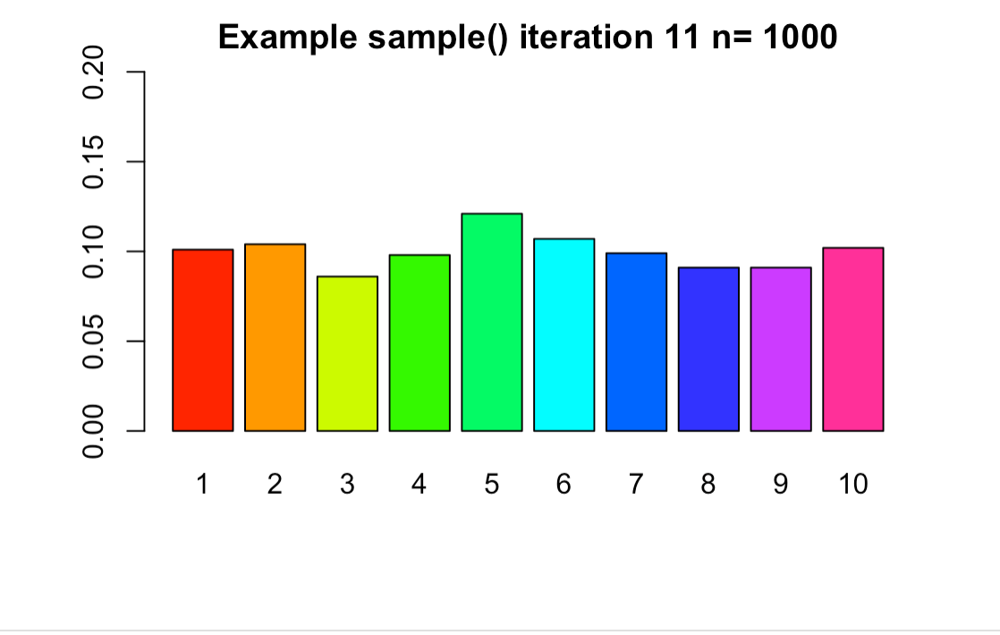

```{r setup, include=FALSE}
knitr::opts_chunk$set(echo = TRUE)
```

# Task 1

```{r}
getwd()
```

```{r}
MATH4753::mybin()
```

# Task 2

```{r}
MATH4753::mybin(iter=100,n=10,p=0.7)
MATH4753::mybin(iter=200,n=10,p=0.7)
MATH4753::mybin(iter=500,n=10,p=0.7)
MATH4753::mybin(iter=1000,n=10,p=0.7)
MATH4753::mybin(iter=10000,n=10,p=0.7)
```

```{r}
dbin.tab = round(dbinom(0:10, size = 10, prob=0.7), 4)
names(dbin.tab)=-0:10
dbin.tab
```

The values in the table are approximately correct according to the verification, due to each value only having a difference of about 0.0002. 

# Task 3

## Sample without replacement

```{r}
sample(c(1,1,1,1,1,1,1,1,1,1,1,1,0,0,0,0,0,0,0,0), size = 5, replace = FALSE, prob = NULL)
```

## Sample with replacement

```{r}
sample(c(1,1,1,1,1,1,1,1,1,1,1,1,0,0,0,0,0,0,0,0), size = 5, replace = TRUE, prob = NULL)
```

## Hyper funciton

```{r}
myhyper=function(iter=100,N=20,r=12,n=5){
# make a matrix to hold the samples
#initially filled with NA's
sam.mat=matrix(NA,nr=n,nc=iter, byrow=TRUE)
#Make a vector to hold the number of successes over the trials
succ=c()
for( i in 1:iter){
#Fill each column with a new sample
sam.mat[,i]=sample(rep(c(1,0),c(r,N-r)),n,replace=FALSE)
#Calculate a statistic from the sample (this case it is the sum)
succ[i]=sum(sam.mat[,i])
}
#Make a table of successes
succ.tab=table(factor(succ,levels=0:n))
#Make a barplot of the proportions
barplot(succ.tab/(iter), col=rainbow(n+1), main="HYPERGEOMETRIC simulation", xlab="Number of successes")
succ.tab/iter
}
```

```{r}
myhyper(iter=100,n=5, N=20,r=12)
myhyper(iter=200,n=5, N=20,r=12)
myhyper(iter=500,n=5, N=20,r=12)
myhyper(iter=1000,n=5, N=20,r=12)
myhyper(iter=10000,n=5, N=20,r=12)

```

## Verify 

```{r}
dhyp.tab = round(dhyper(x=0:5, m=12, n=8, k=5), 4)
names(dhyp.tab) = 0:5
dhyp.tab
```

The values in the table are approximately correct according to the verification, due to each value only having a difference of about 0.002.

# Task 4

Based on the code, mysample() should run a random sample of n between 1 and 10 iter times. The code will then create a barplot for each sample run.

```{r}
mysample=function(n, iter=10,time=0.5){
for( i in 1:iter){
  #make a sample
  s=sample(1:10,n,replace=TRUE)
  # turn the sample into a factor
  sf=factor(s,levels=1:10)
  #make a barplot
  barplot(table(sf)/n,beside=TRUE,col=rainbow(10), 
  main=paste("Example sample()", " iteration ", i, " n= ", n,sep="") ,
  ylim=c(0,0.2)
  )
  Sys.sleep(time)
  }
}
```

```{r, fig.show = 'hide}
mysample(n=1000, iter=30, time=1)
```

The mysample() code printed a barplot for every second, meaning 30 barplots demonstrating the distribution of the sample.

{ width = 70% }

# Task 5    

```{r}
choose(8,4)
```

$$\binom{8}{4} = 70 $$

$$ P(Y > 4), Y\sim Pois(\lambda = 2) $$

```{r}
1 - ppois(q = 3, lambda = 2)
```

$$ P(Y=10),Y\sim NegBin(p=0.4,r=3)  $$

```{r}
choose(10-1,3-1) * 0.4 ^ 3 * 0.6 ^ (10-3)
```

```{r}
npb = dnbinom( x = 10 - 3, size = 3, prob = 0.4)
```

$$ P(Y \leq 8), Y\sim (n=15,p=0.4) $$

```{r}
pbinom(q = 8, size = 15, prob = 0.4)
```

# Task 6

